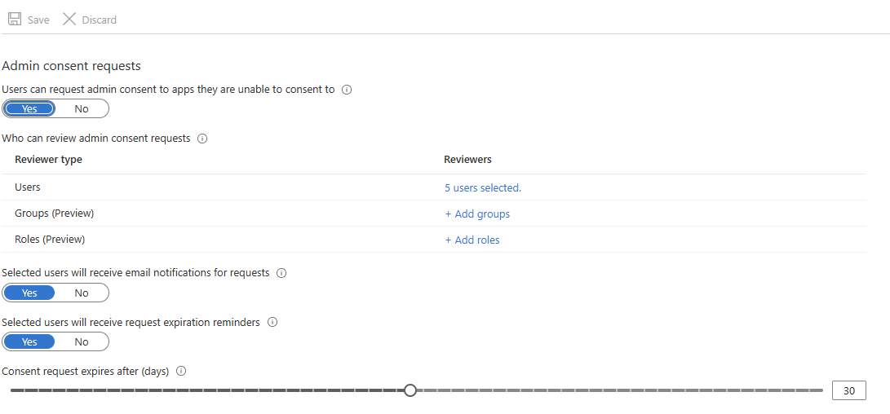

# Blackbird.io Microsoft 365 Teams

Blackbird is the new automation backbone for the language technology industry. Blackbird provides enterprise-scale automation and orchestration with a simple no-code/low-code platform. Blackbird enables ambitious organizations to identify, vet and automate as many processes as possible. Not just localization workflows, but any business and IT process. This repository represents an application that is deployable on Blackbird and usable inside the workflow editor.

## Introduction

<!-- begin docs -->

Microsoft 365 Teams is a collaborative communication platform that combines chat, video conferencing and file sharing, providing a centralized hub for teams to work together seamlessly. It enables organizations to connect, collaborate, and communicate efficiently, whether in remote or office settings.

## Before setting up

Before you can connect you need to make sure that you have a Microsoft 365 account. 

### Using webhooks and actions for channel messages

If you want to use webhooks and/or actions for channel messages, you need to have organization's admin approval. There are two ways to grant admin consent. 

The first way is to grant tenant-wide admin consent to Blackbird application: 

- Sign in to the [Microsoft Entra admin center](https://entra.microsoft.com/) as [global administrator](https://learn.microsoft.com/en-us/azure/active-directory/roles/permissions-reference#global-administrator), [privileged role administrator](https://learn.microsoft.com/en-us/azure/active-directory/roles/permissions-reference#privileged-role-administrator) or user with the [permission to grant permissions to applications](https://learn.microsoft.com/en-us/azure/active-directory/roles/custom-consent-permissions). 
- Browse to _Identity_ > _Applications_ > _Enterprise applications_ > _All applications_.
- Enter _Blackbird_ in the search box, and then select the Blackbird application from the search results.
- Browse to _Security_ > _Permissions_.
- Click on _Grant admin consent for Blackbird.io International LLC_.

The second way is to configure admin consent workflow:

- Sign in to the [Microsoft Entra admin center](https://entra.microsoft.com/) as [global administrator](https://learn.microsoft.com/en-us/azure/active-directory/roles/permissions-reference#global-administrator).
- Browse to _Identity_ > _Applications_ > _Enterprise applications_ > _Consent and permissions_ > _Admin consent settings_.
- Under _Admin consent requests_, select _Yes_ for _Users can request admin consent to apps they are unable to consent to_.
- Configure the following settings:
    * _Who can review admin consent requests_ - select users, groups, or roles that are designated as reviewers for admin consent requests. Reviewers can view, block, or deny admin consent requests, but only global administrators can approve admin consent requests. To approve requests, a reviewer must have the [permissions required](https://learn.microsoft.com/en-us/azure/active-directory/roles/custom-consent-permissions) to grant admin consent for the application requested. People designated as reviewers can view incoming requests in the _My Pending tab_ after they have been set as reviewers. Any new reviewers aren't able to act on existing or expired admin consent requests. 
    * _Selected users will receive email notifications for requests_ - enable or disable email notifications to the reviewers when a request is made.
    * _Selected users will receive request expiration reminders_ - enable or disable reminder email notifications to the reviewers when a request is about to expire.
    * _Consent request expires after (days)_ - Specify how long requests stay valid.
- Click _Save_. 

## Connecting

1. Navigate to apps and search for Microsoft 365 Teams.
2. Click _Add Connection_.
3. Name your connection for future reference e.g. 'My organization'.
4. Under _Channel messages scope required_ specify _Yes_ if you want to use webhooks and/or actions for channel messages and _No_ if not. Different scopes are added to authorization request based on the value of this connection parameter.
5. Click _Authorize connection_.
6. Follow the instructions that Microsoft gives you, authorizing Blackbird.io to act on your behalf.
7. When you return to Blackbird, confirm that the connection has appeared and the status is _Connected_.

## Actions

### Chat

- **List chats** returns the list of chats that the user is part of.
- **Get chat message** retrieves a single message or a message reply in a chat.
- **Download files attached to chat message**.
- **Get the most recent chat messages**.
- **Send message to chat** sends a new message to the specified chat. Optionally, you can attach file from OneDrive and/or file obtained as a result of the previous action.
- **Delete message from chat**.

### Channel

- **Get channel message** retrieves a single message or a message reply in a channel.
- **Download files attached to channel message**.
- **Send message to channel** sends a new message to the specified channel. Optionally, you can attach file from OneDrive and/or file obtained as a result of the previous action.
- **Reply to message in channel** sends a reply to a message to a specified channel. Optionally, you can attach file from OneDrive and/or file obtained as a result of the previous action.

### Users

- **Get my user information** retrieves information about current account.
- **List all users** returns a list of users in your organization.
- **Get user**.
- **Get chat members** lists all conversation members in a chat.

## Events

- **On message sent to chat** is triggered when a new message is sent to the chat.
- **On message with attachments sent to chat** is triggered when a new message with attachments is sent to the chat.
- **On user mentioned in chat** is triggered when a new message is sent to the chat with specified user mentioned.
- **On message sent to channel** is triggered when a new message is sent to the channel.
- **On message with attachment sent to channel** is triggered when a new message with attachments is sent to the channel.
- **On user mentioned in channel** is triggered when a new message is sent to the channel with specified user mentioned.

## Missing features

In the future we can add:

- Webhooks for online meeting recording and transcript 
- Webhooks for chat/channel members
- More actions for teams, channels, chats
- Online meeting actions
- Shift and schedule actions

Let us know if you're interested!

<!-- end docs -->
